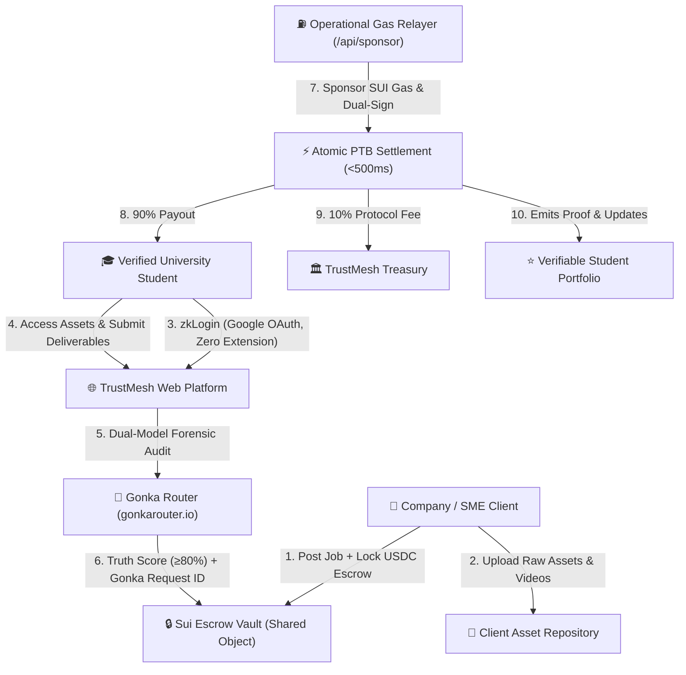

# TrustMesh: AI-Audited Student Talent Marketplace & Trustless Escrow Protocol

> **MUBA Hacks 2026 Submission**  
> Tracks: **Sui Track 01 (Stablecoins & Payments)** &bull; **Sui Track 02 (AI × Sui)** &bull; **Gonka Track (AI for Society)**  
> Built with: **Sui Move** &bull; **@mysten/sui & zkLogin** &bull; **Gonka Router (gonkarouter.io)** &bull; **Next.js & TypeScript**

---

## 🌟 Executive Overview

**TrustMesh** is an AI-audited talent marketplace and trustless settlement protocol on Sui connecting corporate clients and SMEs with individually verified university students for paid short-term project work across two high-demand scopes:
1. **Software Development**: Building automation websites and systems (Landing Pages, ERP, HRMS, CRM, Custom Automation Tools).
2. **Digital Marketing**: Creative campaign deliverables, client raw video asset repositories, and social video ads.

TrustMesh synthesizes the **TrustMesh Individual Talent Marketplace Model (SRS v3.0)** with the **UniPact AI & Web3 Escrow Engine (SRS v1.0)** to eliminate both SME ghosting/payment delays and client quality concerns.



---

## 🏆 MUBA Hacks 2026 Multi-Track Alignment

### 1. Sui Track 01 (Payments & Stablecoins)
- **Zero-Friction zkLogin**: University students onboard in 3 seconds using their standard Google account (`@apu.edu.my`) without managing seed phrases, private keys, or installing browser wallet extensions.
- **Gasless Stablecoin Relayer (`/api/sponsor`)**: An operational SUI gas pool sponsors all network transaction fees. Students and clients only see and spend their testnet USDC balance.
- **Atomic PTB Fee Splitting**: Each milestone release executes in a single Programmable Transaction Block (PTB) routing 90% to the student and 10% to the platform treasury in $<500$ms.

### 2. Sui Track 02 (AI × Sui Copilot)
- **Autonomous Execution PTB Builder**: Dynamically transforms unstructured deliverable proofs and Gonka AI audit outputs into verified Sui Move calls with embedded Gonka Request IDs.

### 3. Gonka Track (AI for Society)
- **Impartial Forensic Audit via Gonka Router (`gonkarouter.io`)**: Mitigates SME ghosting and protects student talent through dual-model parallel verification:
  - **Audit Call 1 (Scope Adherence)**: Verifies deliverables against the agreed acceptance criteria.
  - **Audit Call 2 (Code/Content Quality)**: Scans for placeholder code (TODOs), dummy assets, and template duplication.
- **Cryptographic Gate**: Enforces a minimum Truth Score of $80\%$ to enable milestone release, producing canonical Gonka Request IDs (e.g. `gnk-req-2026-trustmesh-pass`).

---

## 📦 Core Technical Architecture

### 1. Sui Move Smart Contracts (`unipact-protocol/contracts/sources/`)
- `trustmesh_escrow.move`:
  - `EscrowVault<T>`: Shared object holding corporate client deposits.
  - `MilestoneAuditedEvent`: On-chain proof storing `gonka_request_id`, `truth_score`, and payout details.
  - `release_audited_milestone`: Atomic 90/10 milestone disbursement.
  - `trustmesh::mock_usdc`: Faucet-enabled testnet stablecoin dispenser.
- `group_pool.move`:
  - `GroupPool`: Shared object managing multi-student team project splits and campus group tabs.
  - `AdminCap`: Capability pattern for dispute resolution and treasury management.

### 2. Frontend & Gas Station Relayer (`unipact-protocol/frontend/`)
- **Talent Marketplace**: Filter by Software Development (ERP/HRMS/CRM) or Digital Marketing (Raw Video Footage & Campaigns).
- **Client Asset Repository**: Confidential repository for briefs, brand assets, and raw video files.
- **AI Escrow Audit Engine**: Direct integration with Gonka Router API.
- **Verifiable Student Portfolio**: Shareable public profiles with cryptographic Gonka audit certificates and automated Project Report PDF downloads.
- **Merchant & Club POS QR Terminal**: Dynamic payment QR code generator and live mobile camera scanner.

---

## 🚀 Getting Started

### Run Frontend & Relayer
```bash
cd unipact-protocol/frontend
npm install
npm run dev
```
Open **[http://localhost:3000](http://localhost:3000)** in your browser.

### Test Smart Contracts (Sui Move)
```bash
cd unipact-protocol/contracts
sui move build
sui move test
```

---

## 👥 Hackathon Team & Evaluation Personas
Switch personas instantly in the top-right header:
- **Bob Lee**: Verified Student Engineer (Asia Pacific University) &bull; Pending milestone & portfolio.
- **Alice Tan**: Corporate Project Sponsor &bull; Apex Retail Solutions.
- **Charlie Wong**: Digital Marketing Talent (Multimedia University).
- **Dave's Campus Cafe**: Merchant POS Stall.
- **Eva**: TrustMesh Platform Treasurer.
