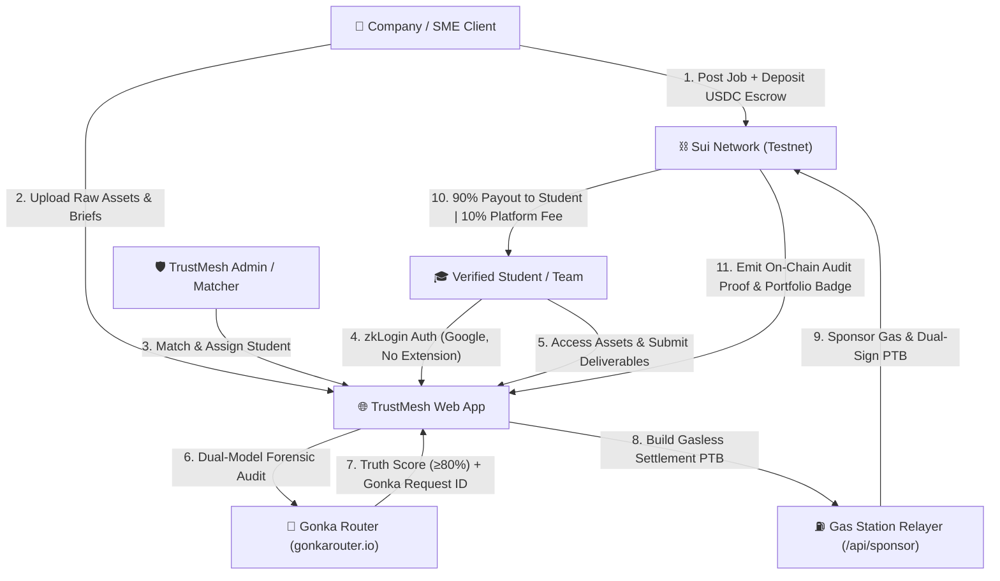

# TrustMesh: AI-Audited Student Freelance & Talent Settlement Protocol
## Unified Software Requirements Specification (Master SRS v3.5)
**Target Competition:** MUBA Hacks 2026 (Sui Track 01, Sui Track 02, Gonka Track)  
**Submission Deadline:** 5 September 2026, 11:59 PM MYT  
**Demo / Pitch Date:** 6 September 2026 at Asia Pacific University (APU)  
**Status:** Approved for Implementation & Hackathon Execution  

---

## Executive Summary & Product Vision

**TrustMesh** is an AI-audited talent marketplace and trustless settlement protocol on Sui that connects companies (SMEs and corporate partners) with individually verified university students for paid project work in **Software Development** (ERP, HRMS, CRM, Landing Pages, Automation Tools) and **Digital Marketing** (video editing, creative campaigns).

TrustMesh merges:
1. **The TrustMesh Talent & Marketplace Architecture** (Company/Student/Admin personas, Job Posting, Client Asset Repository, Admin Curation, Deliverable Management, Automated Project Reports, and Verifiable Student Portfolios).
2. **The UniPact Web3 & AI Escrow Engine** (Instant Google zkLogin onboarding, Operational Gas Station Relayer for gasless USDC settlements, Gonka Router dual-model forensic auditing, and atomic Programmable Transaction Blocks (PTBs) routing 90% to student(s) and 10% to TrustMesh Treasury).



---

## 1. Multi-Track Hackathon Alignment (MUBA Hacks 2026)

| Track | Integration in TrustMesh | Verification & Proof |
| :--- | :--- | :--- |
| **Sui Track 01**<br>*(Payments & Stablecoins)* | • **Zero-Friction zkLogin**: Google OAuth login with ephemeral Ed25519 keypair and Groth16 zero-knowledge proof.<br>• **Gasless Relayer (`/api/sponsor`)**: Operational gas pool pays SUI fees; students and clients only spend testnet USDC.<br>• **Atomic one-to-many PTB Payout**: Programmable Transaction Block splits funds atomically (90% student, 10% platform fee, or multi-student team split) in under 500ms. | • Sui Explorer / SuiScan transaction links.<br>• Sub-500ms latency timer and gasless receipt modal. |
| **Sui Track 02**<br>*(AI × Sui Copilot)* | • **Autonomous Execution Copilot**: Dynamic PTB builder translates unstructured milestone deliverables and Gonka audit verdicts into valid Sui PTB execution blocks with embedded Gonka Request IDs. | • Step-by-step PTB Command Inspector in UI.<br>• Smart contract event logs containing verification metadata. |
| **Gonka Track**<br>*(AI for Society)* | • **Impartial Milestone Audit**: Eliminates SME ghosting and protects student freelancers using Gonka Router (`gonkarouter.io`).<br>• **Dual-Model Audit**: Model 1 (Scope Compliance & Acceptance Criteria) + Model 2 (Code/Content Quality & Authenticity).<br>• **Gonka Settlement Gate**: Score 80% or above unlocks release; Score below 80% provides actionable forensic feedback. | • Verifiable canonical Gonka Request IDs (e.g. `gnk-req-2026-trustmesh-4981`).<br>• Reasoning trace with itemized findings. |

---

## 2. Core User Roles & Personas

### 2.1 Company User (SME Client / Project Sponsor)
- **Profile**: HR Manager, Marketing Director, or SME business owner.
- **Verification**: Email domain detection (Corporate domains e.g. `@maxis.com.my` follow Silent Verification; public domains e.g. `@gmail.com` require SSM certificate upload).
- **Workflows**:
  - Post jobs in **Software Development** or **Digital Marketing**.
  - Upload raw assets (briefs, brand assets, raw video footage) to the confidential Client Asset Repository.
  - Fund milestone escrow in testnet USDC.
  - Review student deliverables, inspect Gonka AI audit reports, and authorize audited milestone release.

### 2.2 Student User (Talent / Freelancer)
- **Profile**: Verified university student (APU, UM, UTM, etc.) specializing in software development or digital marketing.
- **Onboarding**: 1-click **zkLogin via Google account** (no seed phrases, no private key management, no browser extension).
- **Workflows**:
  - Verified via university email (`@apu.edu.my`) or student ID card.
  - Review matched jobs and access confidential raw assets and video footage.
  - Submit proof-of-work deliverables (GitHub PR, live demo URL, Figma link, edited video deliverables, summary notes).
  - Receive automated 90% USDC payouts directly into their zkLogin wallet with 0 SUI gas fees.
  - Build a tamper-proof **Verifiable Portfolio** containing Gonka audit proofs and completed Project Reports.

### 2.3 TrustMesh Admin / Matchmaker
- **Profile**: TrustMesh operations lead and system matchmaker.
- **Workflows**:
  - Review pending student and company verifications.
  - Match and assign the best-fit student or small student team to open jobs.
  - Arbitrate disputes using the Move `AdminCap` capability pattern.
  - Review platform analytics and withdraw collected platform treasury fees.

---

## 3. Detailed Functional Modules

### Module 1: zkLogin Authentication & Gasless Relayer
- **FR-1.1 Ephemeral Session**: Generates ephemeral Ed25519 keypair and creates a maximum-epoch expiration constraint.
- **FR-1.2 OpenID Connect**: Authenticates user via Google OAuth 2.0 to retrieve signed JWT nonce.
- **FR-1.3 ZK Proof & Address Derivation**: Computes Groth16 zero-knowledge proof binding ephemeral public key to user email salt, deriving deterministic Sui address.
- **FR-1.4 Gasless Relayer (`/api/sponsor`)**: Backend relayer attaches sponsor gas coin, signs transaction as `gas_payer`, and returns dual-sign payload. User pays 0 SUI gas.

### Module 2: Job Posting & Client Asset Repository
- **FR-2.1 Two Project Scopes**:
  - **Software Development**: Sub-type (Landing Page / Website, ERP, HRMS, CRM, Custom Automation), Tech Stack, Project Outcome Description, Deliverable specifications.
  - **Digital Marketing**: Campaign Objective, Target Platforms/KPIs, Deliverables, and Raw Video Upload area for client-supplied footage.
- **FR-2.2 Client Asset Repository**: Secure repository for briefs, brand assets, and raw video footage. Visible only to client, admin, and assigned student team.
- **FR-2.3 Escrow Vault Creation**: Company deposits project budget into Sui `EscrowVault<Coin<USDC>>` shared object.

### Module 3: Gonka AI Forensic Audit Engine
- **FR-3.1 Parallel Dual-Model Dispatches via Gonka Router (`gonkarouter.io`)**:
  - **Audit Call 1 (Scope Compliance)**: Checks submission against acceptance criteria.
  - **Audit Call 2 (Code/Content Quality)**: Flags placeholder code (TODOs), dummy files, broken links, direct template duplication.
- **FR-3.2 Verification Output**:
  - **Truth Score**: Integer (0 to 100).
  - **Reasoning Trace**: Bulleted list of verified items and deficiencies.
  - **Gonka Request ID**: Canonical audit string (e.g. `gnk-req-2026-trustmesh-8821`).
- **FR-3.3 Settlement Gate**:
  - If the score is 80 or above, the UI enables the "Authorize Audited Release" button.
  - If the score is below 80, the release button is locked, displaying actionable feedback.

### Module 4: Atomic PTB Settlement & Payout Routing
- **FR-4.1 Dynamic PTB Construction**: Converts approved audit results into a Sui PTB:
  - Validates Truth Score 80 or above.
  - Deducts 10% protocol fee routed to TrustMesh Treasury.
  - Routes 90% milestone payout to student zkLogin address (or splits among multi-student team members).
  - Emits `MilestoneAuditedEvent` on-chain with the canonical Gonka Request ID.
- **FR-4.2 Sub-500ms Atomic Finality**: Entire transaction executes in a single block; all-or-nothing guarantee.

### Module 5: Automated Project Report & Verifiable Portfolio
- **FR-5.1 Automated Project Report**: On completion, generates a downloadable summary containing project timeline, client info, deliverables, student role, and Gonka verification ID.
- **FR-5.2 Verifiable Student Portfolio**: Public profile URL displaying verified skills, project history, client feedback, and on-chain verification badges.

---

## 4. Smart Contract Architecture (Sui Move)

### 4.1 Module `trustmesh::escrow`
```move
module trustmesh::escrow {
    use sui::object::{Self, UID};
    use sui::tx_context::{Self, TxContext};
    use sui::coin::{Self, Coin};
    use sui::balance::{Self, Balance};
    use sui::transfer;
    use sui::event;
    use std::string::String;

    // Error Codes
    const EINVALID_CALLER: u64 = 100;
    const ESCORE_TOO_LOW: u64 = 101;
    const EINSUFFICIENT_FUNDS: u64 = 102;
    const EVAULT_INACTIVE: u64 = 103;

    public struct EscrowVault<phantom T> has key {
        id: UID,
        client: address,
        student: address,
        treasury: address,
        balance: Balance<T>,
        is_active: bool,
    }

    public struct MilestoneAuditedEvent has copy, drop {
        escrow_id: address,
        gonka_request_id: String,
        truth_score: u8,
        payout_amount: u64,
        fee_amount: u64,
        student: address,
    }

    public entry fun create_and_deposit<T>(
        student: address,
        treasury: address,
        deposit: Coin<T>,
        ctx: &mut TxContext
    ) { ... }

    public entry fun release_audited_milestone<T>(
        vault: &mut EscrowVault<T>,
        gonka_request_id: String,
        truth_score: u8,
        ctx: &mut TxContext
    ) {
        assert!(truth_score >= 80, ESCORE_TOO_LOW);
        assert!(vault.is_active, EVAULT_INACTIVE);

        let total_val = balance::value(&vault.balance);
        let fee_amount = total_val / 10;
        let student_amount = total_val - fee_amount;

        let fee_coin = coin::from_balance(balance::split(&mut vault.balance, fee_amount), ctx);
        let student_coin = coin::from_balance(balance::split(&mut vault.balance, student_amount), ctx);

        transfer::public_transfer(fee_coin, vault.treasury);
        transfer::public_transfer(student_coin, vault.student);
        vault.is_active = false;

        event::emit(MilestoneAuditedEvent {
            escrow_id: object::uid_to_address(&vault.id),
            gonka_request_id,
            truth_score,
            payout_amount: student_amount,
            fee_amount,
            student: vault.student,
        });
    }
}
```

### 4.2 Module `trustmesh::group_pool` (Team Splits & Dynamic Tabs)
Supports multi-student project teams (e.g. 1 software developer + 1 designer, or video editor + copywriter), handling one-to-many payout routing and `AdminCap` dispute arbitration.

---

## 5. Implementation Roadmap & Execution Plan

1. **Rebranding & Identity**: Unify the codebase under **TrustMesh** branding (logo, navigation, metadata, contract module names).
2. **Integrated Dual-Scope Marketplace UI**:
   - Tab 1: **Active Projects & Escrow**: Company job creation (Software Dev & Digital Marketing), asset upload, and milestone progress.
   - Tab 2: **Student Deliverable & Gonka AI Audit Engine**: Submission box (code/demo/video), parallel Gonka Router audit, real-time Truth Score & reasoning trace.
   - Tab 3: **Gasless PTB Settlement Terminal**: Dual-sign sponsored release with sub-500ms benchmark and SuiScan explorer links.
   - Tab 4: **Verifiable Student Portfolio & Project Report**: Shareable student portfolio with Gonka audit certificates and downloadable project reports.
   - Tab 5: **Team Splits & POS QR Terminal**: Multi-student team split matrix and merchant/club POS QR codes.
3. **Smart Contract Deployment**: Update Move package definitions to `trustmesh` and compile.
4. **End-to-End Verification**: Validate full flow with browser testing and build checks.
